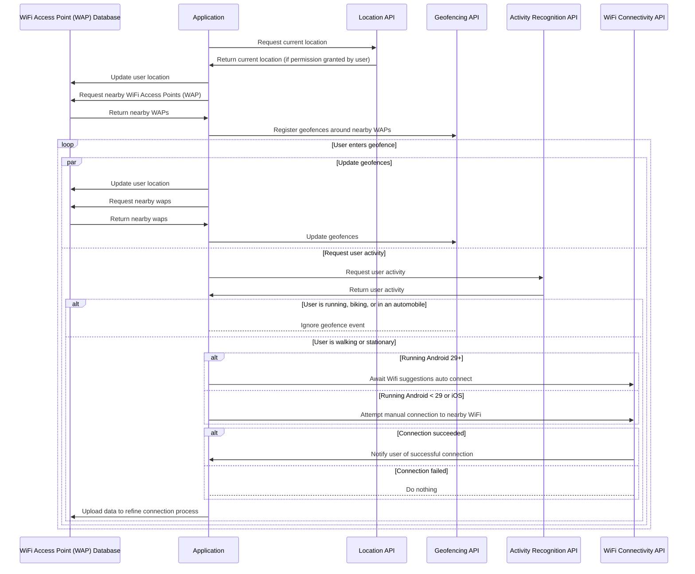

```mermaid
  sequenceDiagram
    participant R as WiFi Access Point (WAP) Database
    participant A as Application
    participant L as Location API
    participant G as Geofencing API
    participant C as Activity Recognition API
    participant W as WiFi Connectivity API
    A->>L: Request current location
    L->>A: Return current location (if permission granted by user)
    A->>R: Update user location
    A->>R: Request nearby WiFi Access Points (WAP)
    R->>A: Return nearby WAPs
    A->>G: Register geofences around nearby WAPs
    loop User enters geofence
      par Update geofences
        A->>R: Update user location
        A->>R: Request nearby waps
        R->>A: Return nearby waps
        A->>G: Update geofences
      and Request user activity
        A->>C: Request user activity
        C->>A: Return user activity
        alt User is running, biking, or in an automobile
          A-->G: Ignore geofence event
        else User is walking or stationary
          alt Running Android 29+
            A->>W: Await Wifi suggestions auto connect
          else Running Android < 29 or iOS
            A->>W: Attempt manual connection to nearby WiFi
          end
          alt Connection succeeded
            W->>A: Notify user of successful connection
          else Connection failed
            W-->A: Do nothing
          end
          A->>R: Upload data to refine connection process
        end
      end
    end
```
