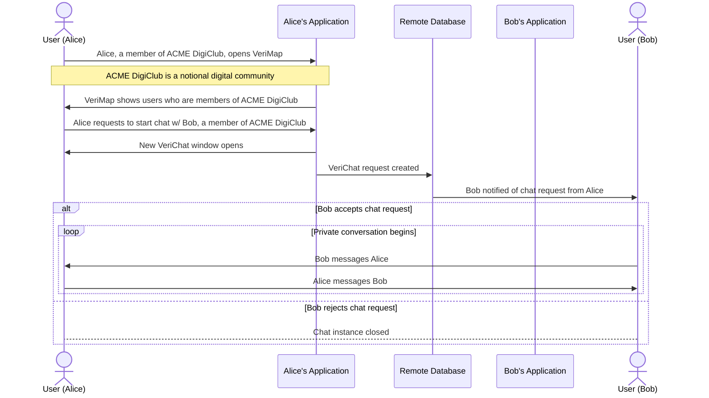

```mermaid
sequenceDiagram
  actor U1 as User (Alice)
  participant A1 as Alice's Application
  participant R as Remote Database
  participant A2 as Bob's Application
  actor U2 as User (Bob)

  U1->>A1: Alice, a member of ACME DigiClub, opens VeriMap
  Note over U1, A1: ACME DigiClub is a notional digital community
  A1->>U1: VeriMap shows users who are members of ACME DigiClub
  U1->>A1: Alice requests to start chat w/ Bob, a member of ACME DigiClub
  A1->>U1: New VeriChat window opens
  A1->>R: VeriChat request created
  R->>U2: Bob notified of chat request from Alice
  alt Bob accepts chat request
    loop Private conversation begins
      U2->>U1: Bob messages Alice
      U1->>U2: Alice messages Bob
    end
  else Bob rejects chat request
    U2-->U1: Chat instance closed
  end
```
