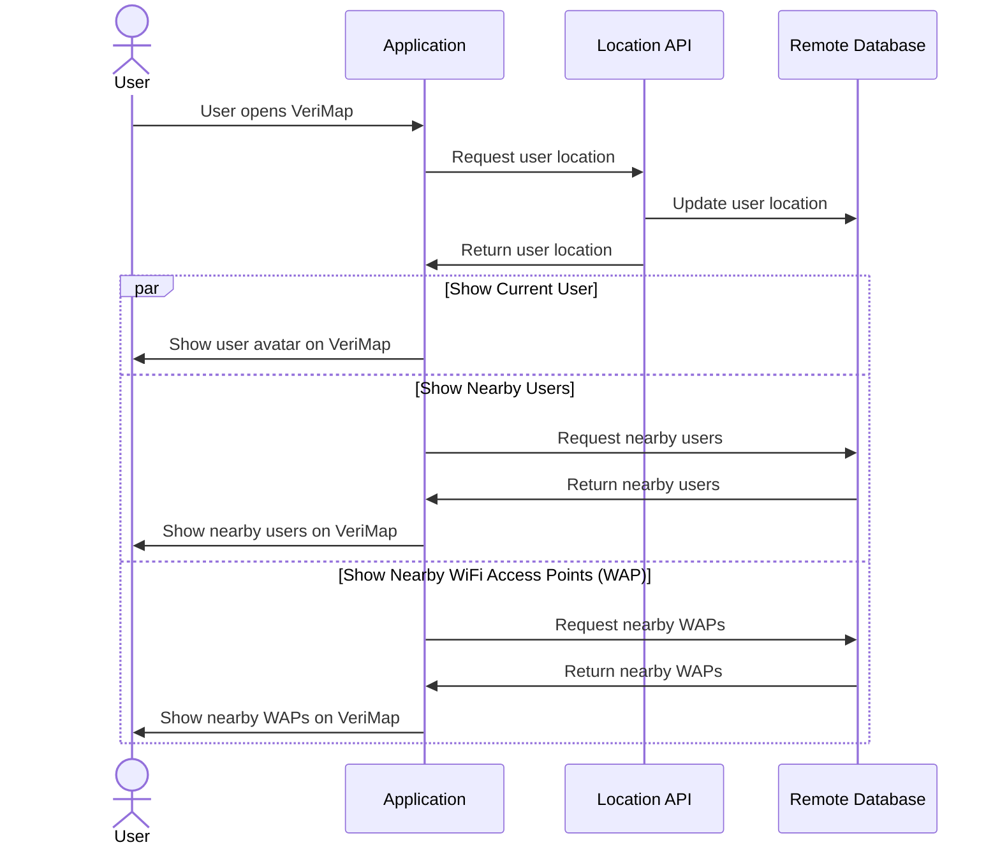

```mermaid
sequenceDiagram
  actor U as User
  participant A as Application
  participant L as Location API
  participant R as Remote Database

  U->>A: User opens VeriMap
  A->>L: Request user location
  L->>R: Update user location
  L->>A: Return user location
  par Show Current User
    A->>U: Show user avatar on VeriMap
  and Show Nearby Users
    A->>R: Request nearby users
    R->>A: Return nearby users
    A->>U: Show nearby users on VeriMap
  and Show Nearby WiFi Access Points (WAP)
    A->>R: Request nearby WAPs
    R->>A: Return nearby WAPs
    A->>U: Show nearby WAPs on VeriMap
  end
```
