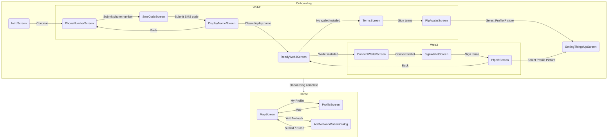

```mermaid
  flowchart TD
    subgraph Onboarding
      s1(IntroScreen)-- Continue -->s2(PhoneNumberScreen)
      s2-- Submit phone number -->s3(SmsCodeScreen);
      s4--Back-->s2
      s3--Submit SMS code-->s4(DisplayNameScreen)
      s4--Claim display name-->s5(ReadyWeb3Screen)

      s5--No wallet installed-->s7(TermsScreen)
      s7--Sign terms-->s11(PfpAvatarScreen)
      s11--Select Profile Picture-->s10

      s5--Wallet installed-->s6(ConnectWalletScreen)
      s9--Back-->s5
      s6--Connect wallet-->s8(SignWalletScreen)
      s8--Sign terms-->s9(PfpNftScreen)
      s9--Select Profile Picture-->s10(SettingThingsUpScreen)

      subgraph Web3
        s6
        s8
        s9
      end

      subgraph Web2
        s2
        s3
        s4
        s7
        s11
      end
    end

    subgraph Home
      s12(MapScreen)--My Profile-->s13(ProfileScreen)
      s13--Map-->s12
      s12--Add Network-->s14(AddNetworkBottomDialog)
      s14--Submit / Close-->s12
    end
    Onboarding--Onboarding complete-->Home
```
